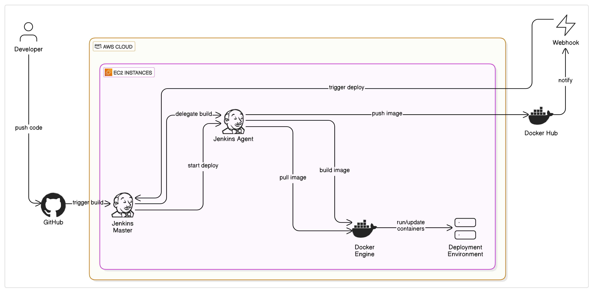

# 🚀 Automated Docker Image Deployment to AWS EC2 using Jenkins, Docker Hub, and GitHub Webhook

This project demonstrates a production-grade **CI/CD pipeline** built with **Jenkins (Master-Agent setup)**, **GitHub Webhooks**, **Docker**, **Docker Hub**, and **AWS EC2**. It automates the entire process from code push ➡ build ➡ image creation ➡ image push ➡ container deployment on an EC2 instance — enabling hands-free delivery of updates.

---

## 📌 Project Summary

- CI/CD pipeline built using **Jenkins** (master-agent model).
- Automatic Docker image builds on every **GitHub push** using **GitHub Webhook**.
- Docker images are pushed to **Docker Hub**.
- **AWS EC2** instance fetches the image and deploys the latest container version.
- Provides a robust, modular, and easily scalable DevOps workflow.

---

## ⚙️ Tech Stack

| Tool/Service     | Purpose                                      |
|------------------|----------------------------------------------|
| **AWS EC2**       | Hosts Jenkins and Docker runtime             |
| **Jenkins**       | Manages CI/CD workflow (master & agent)      |
| **GitHub Webhook**| Triggers Jenkins pipeline on code commits    |
| **Docker**        | Containerization of the application          |
| **Docker Hub**    | Stores and distributes Docker images         |
| **Linux Shell**   | Used for custom deployment scripting         |

---

## 🔄 CI/CD Pipeline Workflow

1. ✅ Code is pushed to **GitHub**
2. 🔔 GitHub **Webhook** triggers **Jenkins**
3. 🧠 Jenkins **Master** delegates job to an **Agent**
4. 🛠️ Jenkins Agent:
    - Clones GitHub repository
    - Builds Docker image
    - Pushes the image to Docker Hub
5. ☁️ AWS EC2 pulls the updated Docker image
6. 🐳 Docker runs the new container on EC2

---

## 🧭 Architecture Diagram



> This diagram illustrates the full CI/CD pipeline flow involving GitHub → Jenkins Master → Jenkins Agent → Docker Hub → EC2 Deployment using Docker Engine.

---

## 📁 Folder Structure

```
.
├── Jenkinsfile              # CI/CD pipeline script
├── Dockerfile               # Docker build instructions
├── app/                     # Sample application code
│   ├── index.js             # App entry point (example: Node.js)
│   └── package.json         # App dependencies
├── scripts/
│   └── deploy.sh            # Optional: Shell script for deployment
└── README.md
```

---

## 📜 Jenkinsfile Example
## Refer Jenkins file attached in Current Repositery

```groovy
pipeline {
    agent any
    environment {
        IMAGE_NAME = 'your-dockerhub-username/your-repo'
    }
    stages {
        stage('Checkout Code') {
            steps {
                git 'https://github.com/your-username/your-repo.git'
            }
        }
        stage('Build Docker Image') {
            steps {
                sh 'docker build -t $IMAGE_NAME .'
            }
        }
        stage('Push to Docker Hub') {
            steps {
                withCredentials([usernamePassword(credentialsId: 'dockerhub-creds', usernameVariable: 'USERNAME', passwordVariable: 'PASSWORD')]) {
                    sh 'echo $PASSWORD | docker login -u $USERNAME --password-stdin'
                    sh 'docker push $IMAGE_NAME'
                }
            }
        }
        stage('Deploy on EC2') {
            steps {
                sshagent(['ec2-ssh-key']) {
                    sh '''
                        ssh ec2-user@<EC2-IP> "docker pull $IMAGE_NAME && docker stop app || true && docker rm app || true && docker run -d --name app -p 80:3000 $IMAGE_NAME"
                    '''
                }
            }
        }
    }
}
```

---

## 🚀 How to Set Up This Project

### 🖥️ 1. Launch EC2 Instances
- One for Jenkins Master
- Optional: One for Jenkins Agent
- One for running the application container

### 🔧 2. Install Required Software
```bash
# On Jenkins EC2
sudo apt update
sudo apt install -y openjdk-11-jdk docker.io git
sudo systemctl start docker
sudo usermod -aG docker jenkins
```

### 🧪 3. Setup Jenkins
- Install plugins: Docker, Docker Pipeline, SSH Agent, GitHub Integration
- Add **Docker Hub Credentials** and **SSH Key** to Jenkins
- Create a pipeline job and paste your `Jenkinsfile`

### 🌐 4. Configure GitHub Webhook
- GitHub → Repo → Settings → Webhooks
- Payload URL: `http://<jenkins-ip>:8080/github-webhook/`
- Content-Type: `application/json`
- Select: `Just the push event`

---

## 🧪 Testing the Pipeline

- Make a code change and push it to GitHub.
- Check Jenkins: It should automatically trigger a build.
- Once completed, SSH into the EC2 app server and check:
```bash
docker ps
curl http://localhost
```

---

## 🔐 Security Best Practices

- Never hardcode credentials (use Jenkins credentials store).
- Secure your EC2 with proper firewall rules.
- Use HTTPS for Jenkins in production.
- Rotate Docker Hub tokens regularly.

---

## 📈 Scaling the Pipeline

- Use **Jenkins Agents** for load balancing across builds.
- Add monitoring with **Prometheus + Grafana**.
- Trigger blue-green or rolling deployments with Kubernetes or ECS.

---

## 🙋‍♂️ Contributing

Contributions are welcome! Please fork the repository and submit a pull request. For major changes, open an issue first to discuss what you’d like to change.

---


## 🙋 About the Author

**Om Atmaram Ghorpade**  
🚀 DevOps & Cloud Enthusiast 
📫 Reach me: omghorpade212000@gmail.com  
🔗 [GitHub (voidVisual)](https://github.com/voidVisual)  
🔗 [LinkedIn](www.linkedin.com/in/omghorpade)

---
